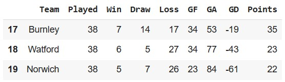
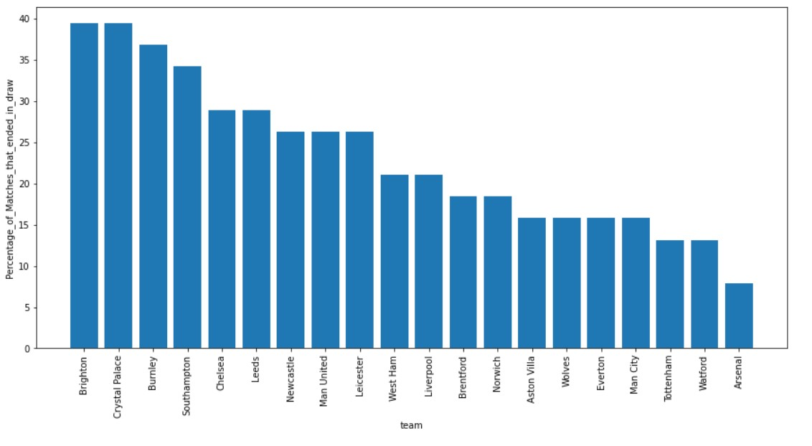

# English_Premier_league_data

Exploration of premier league data for the 2021/2022 season

Link to csv file on Kaggle.com: 

https://www.kaggle.com/datasets/evangower/premier-league-match-data?resource=download

=====
## 1. League Table

The entire results were tabulated into about 6 columns and sorted by the total number of points at the end of the season.
## Columns:
   - Teams: Names of teams for the 2021/2022 season (20 teams in total).
   - Played:  The number of matches played by each team in the entire season (38).
   - Win: The number of wins by each team in the entire season.
   - Loss:  The number of losses in the entire season.
   - Draw: The number of matches that ended in a draw in the entire season.
   - GF: The number of goals scored by a team.
   - GA: The number of goals conceded by a team.
   - GD:  The difference between a team’s goals scored and goals conceded.
   - Points: The total amount of points a team had in the entire season. This is calculated by multiplying the number of wins by 3 and the number of draws by 1 and summing the two.

At the end of the season, it could be seen from the table that Man City had the highest number of points (93 points) and a goal difference of 73 which crowned them as the winner of 
the league for the season followed by Liverpool, Chelsea and Tottenham making the top 4.

Norwich had the least point, followed by Watford and Burnley, relegating them to the lower division. 

=====

## 2. Explore: Which team committed the most fouls?
The interest here is to know teams that are indisciplined. After data exploration, it was observed that Leeds committed the most fouls (469) and Man City committed the least fouls (320). 

	- Does it mean the team that commits the least fouls win the league? 

	- More data will be needed to back that.

=====

## 3. Visualize: Plot the percentage of games that ended in a draw over time

The percentage of the number of draws each team had out of the total number of matches played was plotted on a bar graph. 

	- Brighton had the highest number of matches that ended in a draw (15) with a percentage of 39.4. This implies more than one-third of their total matches ended as draws. 

	- Arsenal had 3 of their matches ending as draws.

